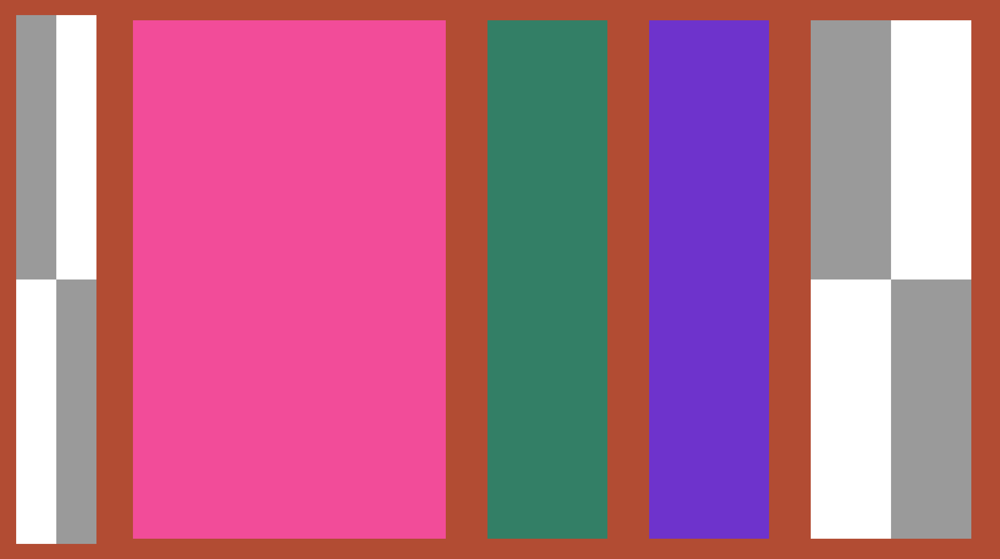

# DoDoUI
DoDoUI

一个精简版的Slate，仿照Unreal的Slate制作，学习Slate的UI框架和UI渲染流程使用。

# ToDo

### 🌏

## 渲染流程

- [x] Vulkan后端渲染UI生成的顶点数据
- [x] 纹理资源管理器
- [x] 多窗口多交换链渲染

## 控件

- [x] 单一子槽SCompoundWidget
- [x] 叶子控件SLeafWidget
- [x] 逻辑窗口SWindow
- [x] 背景板SBorder
- [x] 按钮SButton
- [ ] ...

## 布局

- [x] 锚点
- [x] 画板控件SConstriantCanvas
- [x] 分割线SSplitter
- [x] 水平盒子SBoxPanel
- [ ] ...

## 输入

- [x] 2D点和矩形碰撞检测
- [x] widget树遍历
- [x] 冒泡事件派发
- [x] 委托绑定
- [ ] ...

## 样式

- [x] 样式按需加载，根据纹理资源注册表
- [ ] 圆角矩形
- [ ] ...

## 优化

- [ ] globa invalidation
- [ ] widget cache
- [ ] ...

## 展示

### 水平盒子

#### 声明式语法构建水平盒子

```c++
		SAssignNew(root_window2, SWindow)
			.Title("hello2")
			.ClientSize(glm::vec2(1280.0f, 720.0f))
			.ScreenPosition(glm::vec2(1000.0f, 200.0f))
		    [
		        SNew(SBorder)
		        .BorderBackgroundColor(glm::vec4(0.7f, 0.3f, 0.2f, 1.0f))
				[
		            SNew(SHorizontalBox)
		            + SHorizontalBox::Slot()
		            .Padding(30.0f, 30.0f)
		            .fill_width(0.2f)
					.max_width(600.0f)
		            [
		                SNew(SBorder)
		                .BorderImage(FCoreStyle::get().get_brush("Checkboard"))
		            ]
					+ SHorizontalBox::Slot()
		            .Padding(40.0f, 40.0f)
		            .fill_width(0.8f)
		            .max_width(600.0f)
		            [
		                SNew(SBorder)
		                .BorderBackgroundColor(glm::vec4(0.95f, 0.3f, 0.6f, 1.0f))
		            ]
		            + SHorizontalBox::Slot()
		            .Padding(40.0f, 40.0f)
		            .fill_width(0.3f)
		            .max_width(600.0f)
		            [
		                SNew(SBorder)
		                .BorderBackgroundColor(glm::vec4(0.2f, 0.5f, 0.4f, 1.0f))
		            ]
		            + SHorizontalBox::Slot()
		            .Padding(40.0f, 40.0f)
		            .fill_width(0.3f)
		            .max_width(600.0f)
		            [
		                SNew(SBorder)
		                .BorderBackgroundColor(glm::vec4(0.43f, 0.2f, 0.8f, 1.0f))
		            ]
		            + SHorizontalBox::Slot()
		            .Padding(40.0f, 40.0f)
		            .fill_width(0.4f)
		            .max_width(600.0f)
		            [
		                SNew(SBorder)
		                .BorderImage(FCoreStyle::get().get_brush("Checkboard"))
		            ]
				]
		
		    ];
```




## Build

```c++
git submodule update --init --recursive
mkdir build
cd build
cmake .. -DCMAKE_BUILD_TYPE=Debug 
    
or cmake .. -DCMAKE_BUILD_TYPE=Debug -DCMAKE_GENERATOR_TOOLSET=ClangCL
```

# Test

```c++
mkdir BuildTest
cd BuildTest
ctest --build-and-test .. . --build-generator "Visual Studio 17 2022" --build-options -DENABLE_TEST=1 --test-command ctest -C Debug
```

